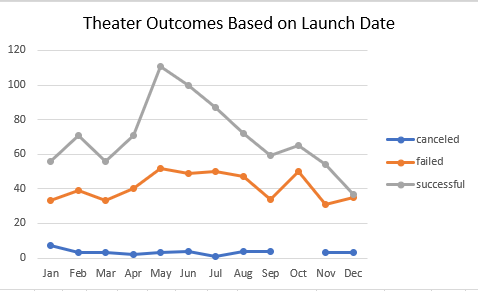
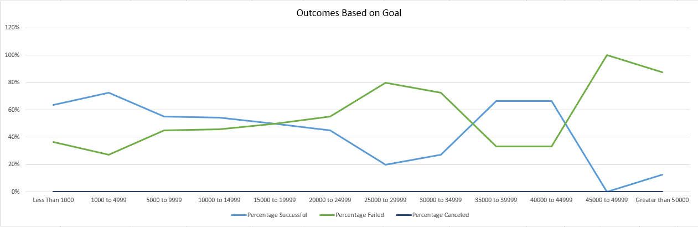

# Kickstarting with Excel

## Overview of Project
This Kickstarter analysis is to provide Louise a clear visual on how successful play campaigns were. This project will analyze campaign outcomes based on launch date and total goal.
### Purpose
The purpose of this analysis is to help Louise understand how launch dates and total goals affect a campaign's success. It is also to help Louise visualize all of the data she requested.
## Analysis and Challenges
Overall, Louise should start her Kickstarter campaign in the summer, around May or June, and have a goal under $5,000. Challenges that I encountered in this module were with the box and whisker plot. Even with filtering everything according to the instructions, I struggled to have a correct visualization. Additionally, I struggled with the COUNTIFS() function. I had to research and play around with the function to come up with the correct formula.
### Analysis of Outcomes Based on Launch Date
Based on the data, I discovered that based on Launch Date, the most successful months for Theater campaigns is during the summer months, May through August. 

### Analysis of Outcomes Based on Goals
Louise should aim to have a Kickstarter goal under $5,000, and preferably between $1,000 and $5,000. In the data, these ranges show to be the most successful.

### Challenges and Difficulties Encountered
Challenges I encountered were with the COUNTIFS() function and with the box and whisker plot. I could not produce an accurate box and whisker plot. I did not successfully work through the COUNTIFS() function on my own; the resources provided were helpful and the video helped me work through it successfully.
## Results

###### What are two conclusions you can draw about the Outcomes based on Launch Date?
Based on Launch Date, Louise should start her campaign in May or June. Another conclusion is to have Louise avoid beginning her campaign in December as it is the least successful of all of the months.
###### What can you conclude about the Outcomes based on Goals?
According to the data, Louise should keep her Goal under $5,000. Preferably, she should make her Goal between $1,000 and $5,000 as that is most successful range. Goals over $45,000 should be avoided altogether because of their high risk of failing.
###### What are some limitations of this dataset?
Some limitations of this dataset is it is not specific to her location. While it is able to be filtered by country, the US is so large and has many different types of cities and populations, we do not know if Louise's campaign will be successful. For example, Louise's campaign might be successful in New York, where there is a large market for theater, but might fail in Nebraska under the same conditions. An additional limitation of the data is the age of it. It is only current up to 2017, and new data could change the outcomes.
###### What are some other possible tables and/or graphs that we could create?
Another important graph to present to Louise is how successful campaigns are that are a Staff Pick or are spotlighted. This could show how necessary it would be for Louise to advocate for her campaign to be a Staff Pick or spotlighted. Also, we should look at if the number of backers influences the campaign's success at all.
